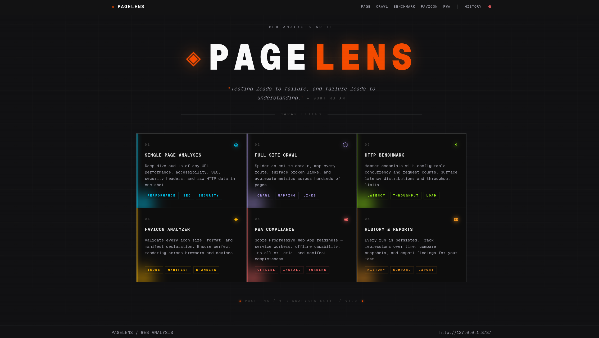

# PageLens



A web analysis suite for developers. Point it at any URL and get back SEO signals, performance data, crawl maps, favicon audits, PWA scores, and HTTP benchmarks — from a clean UI, a REST API, or the terminal.

## What it does

- **Single page analysis** — deep audit of any URL: headers, SEO, accessibility, snapshots
- **Full site crawl** — spider a domain, map routes, surface broken links
- **HTTP benchmarking** — hit endpoints with configurable concurrency, see latency distributions
- **Favicon analysis** — validate every icon size, format, and manifest entry
- **PWA scoring** — service workers, install criteria, offline capability
- **History** — every run is persisted and comparable

## Stack

Rust core engine (`pagelens-core`) powering browser automation, crawling, and analysis — exposed via a Rust HTTP API (`pagelens-api`) and a CLI (`pagelens-cli`). The frontend is a SvelteKit app built with Tailwind and shadcn/ui.

## Getting started

```bash
bun install
bun run dev
```

Requires Bun ≥ 1.3, Node ≥ 20, and a stable Rust toolchain. Or use the pinned Nix shell:

```bash
nix develop
```

## License

MIT
